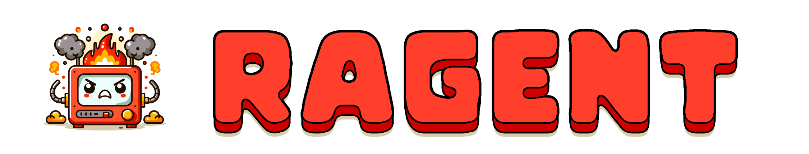

    

    
    
    
    

# Ragent
A Rust-based framework for agents--designed with a focus on ease-of-use and performance in the cloud, on the web and on embedded devices for real-time, multimodal, multi-agent interactions.
